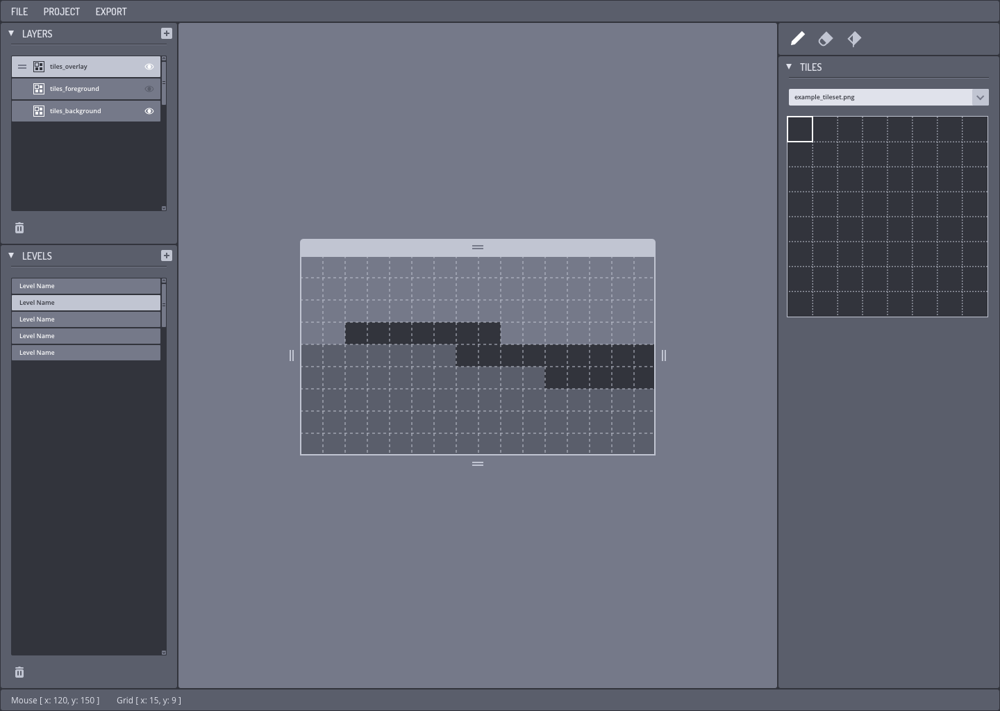

# OpenTL

 
A user friendly, cross platform, module based, robust, completely scriptable/moddable, project oriented map editor.
 

group collaboration project spawning from the haxeflixel discord!

Want to contribute click [here](https://github.com/OpenTL-Project/OpenTL/blob/master/BUILD.MD)!

## Design MVP Mockup by 01010111

### Tech used

- [OpenFL](https://github.com/openfl/openfl)
- [Lime](https://github.com/openfl/lime)
- [Actuate](https://github.com/jgranick/actuate)
- [SVG](https://github.com/openfl/svg)
- [App](https://github.com/PXshadow/App)

## Current Functionality
- Zoom and drag
- tile scaling
- inital progress on tabs (Layers,Levels,Tiles)
- window resizing
